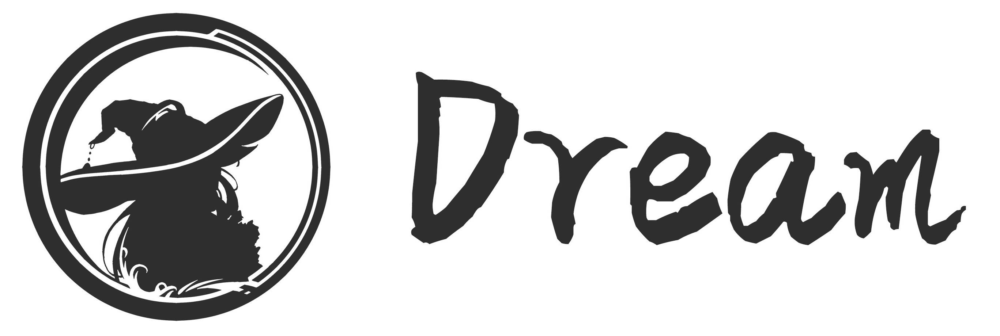

# Dream - 高效强大的 Lua 视觉小说游戏框架

### DreamFramework 是基于 [EtherEngine](https://github.com/VoidmatrixHeathcliff/EtherEngine) 搭建的视觉小说类游戏开发框架，优势如下：

+ 信手拈来，像写小说一样书写游戏脚本，将你的灵感快速转化为生产力

+ 简明易学，逻辑及渲染等系统均使用脚本开发，学习和开发成本低

+ 轻巧高效，框架核心使用 C++ 编写，体积小巧且无臃肿依赖

+ 扩展性强，基于 [EtherEngine](https://github.com/VoidmatrixHeathcliff/EtherEngine) 开发，无论是 Lua 还是 C++ 模块都可以轻松兼容

+ 未来可期，兼容新一代 Galgame 标准 [Uni-Gal](https://github.com/Uni-Gal) ，方便快速导出导入

## 演出示例

> 此处应该有 图片/视频

## 文档教程

> 待更新

## 特别鸣谢

> 可能会有

## 联系开发组

> 先把邮箱放这里：Voidmatrix@qq.com