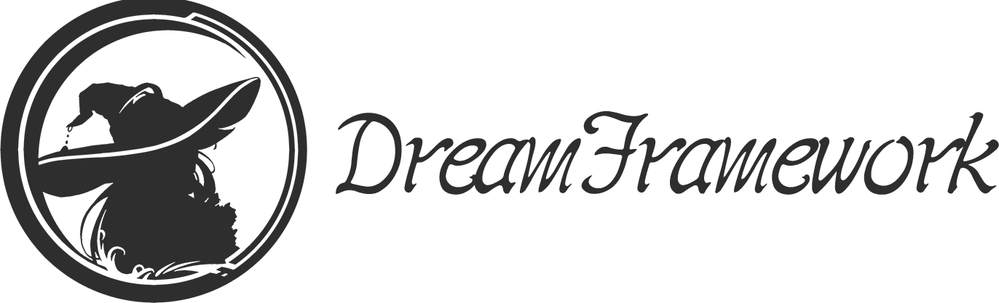

# DreamFramework - 高效强大的 Lua 视觉小说游戏框架

**DreamFramework 是基于 [EtherEngine](https://github.com/VoidmatrixHeathcliff/EtherEngine) 搭建的 AVG 类游戏开发框架**

## 特点

+ ***信手拈来*** - 像写小说一样编写演出脚本，将你的灵感快速转化为生产力
+ ***简明易学*** - 逻辑及渲染等系统均使用 Lua 脚本开发，并提供大量内置模板，学习和开发成本低
+ ***轻巧高效*** - 框架核心使用 C++ 编写，体积小巧且无臃肿依赖，性能至上
+ ***扩展性强*** - 基于 [EtherEngine](https://github.com/VoidmatrixHeathcliff/EtherEngine) 开发，无论是 Lua 还是 C++ 模块都可以轻松兼容
+ ***职责明确*** - 程序、编剧、导演等各司其职，借助可视化工具生成 DreamScript，提高团队效率
+ ***超多平台*** - 支持包括 Windows / Mac / Android 等多个平台，一次开发，处处运行
+ ***未来可期*** - 兼容新一代 Galgame 标准 [Uni-Gal](https://github.com/Uni-Gal) ，方便在不同开发工具间快速导入导出

## 演出示例

> 此处应该有 图片/视频

## 文档教程

关于 DreamScript 的设计文档，见 [此处](docs/DreamScript_doc.md)

关于 DreamScript 的预实现文档，见 [此处](docs/DreamScript_pre_doc.md)

## 特别鸣谢

+ 感谢 [许兴逸](https://github.com/Seng-Jik) 老师在 DreamScript 设计中宝贵的建议

## 佳作展示

> 但愿有人会用

## 联系开发组

> 先把邮箱放这里：Voidmatrix@qq.com
